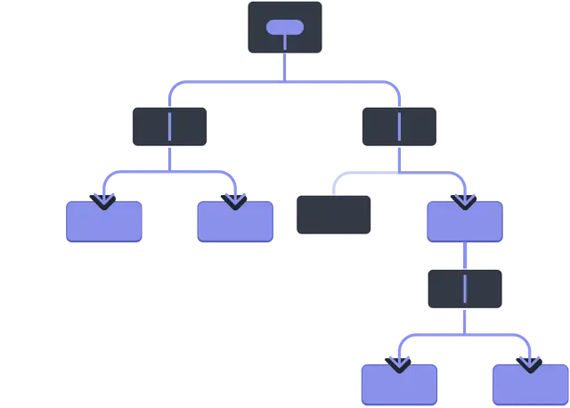

# points of React

1. Always use functional approach to update an state or store data into Array or Object
2. React is everything about Family Matter's (Parent-child-sibling communication)

## State

#### Functional State Update Approach | Batch scheduling:

- The statement uses a functional update (oldState => [...oldState, InputData]). This ensures that the state update is based on the most recent state, which is crucial in asynchronous environments like React where state updates might be batched.

## Props

- while passing a prop first entity would be an key which passed as an argument and second Entity which was in curly braces call in parent component

- Dashboard key={value(parent_part)} children={parent}

- when we pass a properties (props), we always wanted to destructure it in other component.

- Ex: const List = ({props or name of props}) =>{}

- Props are similar to arguments/ parameters, like as we use in vanilla Javascript

- Props is everything is about Parent-child communication

## Example

#### Vanilla JS

- function car(model,type){
  return(
  dash(model,type)
  )
  }
  car("Ford", "Muscle Hatchback")

#### React

- function car (){
  return(
  <{dash argument={data} }/>
  )
  }

- sending argument to dash component which local to car

- function dash (parameter){
  return(
  ....
  )
  }

## Component Extraction or props variation

#### Variation 1: same approach as followed

- Parent : {Dash item={item}}
- Child : const Item = (props) => (
  (li)
  (span)
  (a href={props.url}>{props.title} a)
  (span)
  (li)
  );

#### Variation 2: sending all the properties while map and destructure props in child

- Parent : {list.map((item) => (
  (Item
  key={item.objectID}
  title={item.title}
  url={item.url}
  author={item.author}
  num_comments={item.num_comments}
  points={item.points}
  />)
  ))}

- Child : const Item = ({ title, url, author, num_comments, points }) => (
  (li)
  (span)
  (a href={url}>{title} a)
  (span)
  (li)
  );

#### Variation 3: sending spread properties while map and destructure props in child(same as var 2)

- Parent : {list.map((item) => (
  (Item key={item.objectID} {...item}/>)
  ))}

----------or---------

- Parent : {list.map(({objectID, ...item}) => (
  (Item key={objectID} {...item}/>)
  ))}

- Child : Same as above

## Context Api

#### Prop Drilling

- It refers to the process of passing data (props) from a parent component through multiple layers of child components to a deeply nested component that actually needs the data.

#### Example

- import React from 'react';

const ParentComponent = () => {
const data = "Hello from Parent!";

return (

div
ChildComponent data={data} />
/div>
);
};

const ChildComponent = ({ data }) => {
return (

div
GrandchildComponent data={data} />
div>
);
};

const GrandchildComponent = ({ data }) => {
return (

div>
{data}
div>
);
};

- the data prop is passed from ParentComponent to ChildComponent and finally to GrandchildComponent. 
- Even though ChildComponent doesn't actually need the data, it acts as a "middleman" to pass it down.

#### Visual Representation

#### Issue
- Make code harder to understand and maintain
- Unnecessary use of component which actually don't need the data.

### Solution
- context api
- Redux or other state management system

### context api Definition
- It is a a way to pass data through the component tree without having to pass props down manually at every level.
- It is used to pass global variables anywhere in the code without the prop drilling.

### Procedure 

* Creating and export a new context object
* Providing a context object with the same name as the context object created above and pass it with value.
* Wrap the parent component inside component where context object is created, So that every children can access the data.
* Use the context object created above using useContext() hook

## Code
### contextProvider.jsx (Provider)

import React from "react";

import { useState } from "react";

export const GlobalInfo = React.createContext(null);

const contextProvider = ({ children }) => {
  const [theme, setTheme] = useState("dark");

  const ToggleTheme = () => {
    setTheme(theme === "light" ? "dark" : "light");
  };

  return 
    GlobalInfo.Provider value={{ theme, ToggleTheme }}>
      {children}
    GlobalInfo.Provider>

    OR
  - sending as key value pairs  
    GlobalInfo.Provider value={{ Theme : theme, AnyFunctionName : ToggleTheme }}>
      {children}
    GlobalInfo.Provider>
};

export default contextProvider;

### Index.jsx (wrapper)
- import { createRoot } from "react-dom/client";
- import "./index.css";
- import App from "./App.jsx";
- import contextProvider from "./Components/contextProvider";
- createRoot(document.getElementById("root")).render(
  contextProvider
    App 
  contextProvider
);

### consumer.jsx (consumer)
- import { useContext } from "react";
- import { GlobalInfo } from "./Components/contextProvider";
- const { theme, ToggleTheme } = useContext(GlobalInfo);

## Routing
### Procedure
- Install using  npm i react-router-dom@6 or latest version
- Wrap The parent component with BrowserRouter
- Create Routes using Routes,Route, path, element
- Create common Routes component AllRoutes
- Create Private Routes component(if Needed)